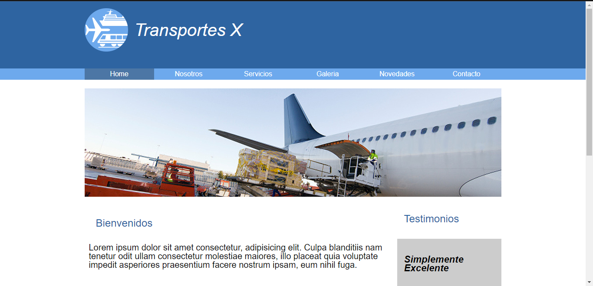

# Proyecto Integrador BA Multiplica

Este es un proyecto integrador para el curso de Desarrollo Web de BA Multiplica. Su objetivo fue crear y desarrollar una página web básica, con un diseño responsive, que contenga información sobre un tema de interés. En este caso será Transportistas, ya que se tomó como modelo el sitio proporcionado con las fotos e imágenes facilitadas.

## Tabla de Contenidos

- [Proyecto Integrador BA Multiplica](#proyecto-integrador-ba-multiplica)
  - [Tabla de Contenidos](#tabla-de-contenidos)
  - [Instalación](#instalación)
  - [Galería](#galería)
    - [Home](#home)
    - [Contacto](#contacto)
  - [Contactarme](#contactarme)

## Instalación

1. Clona el repositorio:

   ```shell
   git clone https://github.com/Cmoros/integrador-BA-M.git
   ```

2. Navega hasta el directorio del proyecto:

   ```shell
   cd integrador-BA-M
   ```

3. Abre el archivo index.html en tu navegador web preferido.

## Galería

### Home



### Contacto


## Contactarme

Si tienes alguna pregunta, sugerencia o comentario, no dudes en contactarme.
